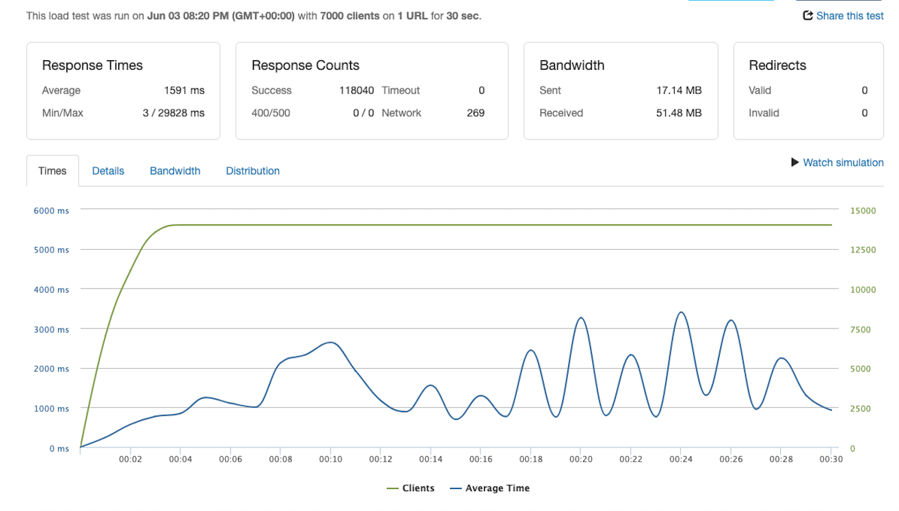
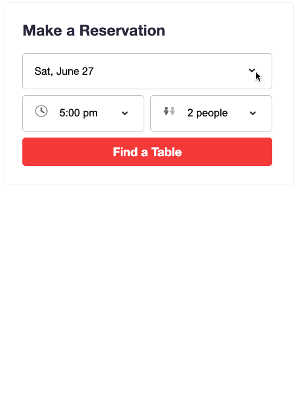

# restaurants-rating-web-app

# Project Name

> Full Stack Restaurant Rating Web App


    For 7000 Clients/Second Stress Test



  <br />

    React Calendar and Booking Component



## Table of Contents

1. [Usage](#Usage)
1. [Requirements](#requirements)
1. [Development](#development)

## Start the Application

- npm install
- Server, npm run server-dev

## Usage

> Some usage instructions

## Requirements

An `nvmrc` file is included if using [nvm](https://github.com/creationix/nvm).

- Node 6.13.0
- etc

## Development

### Installing Dependencies

From within the root directory:

```sh
npm install -g webpack
npm install
```

